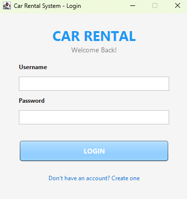
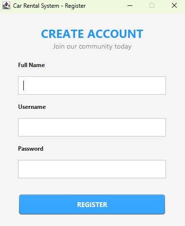
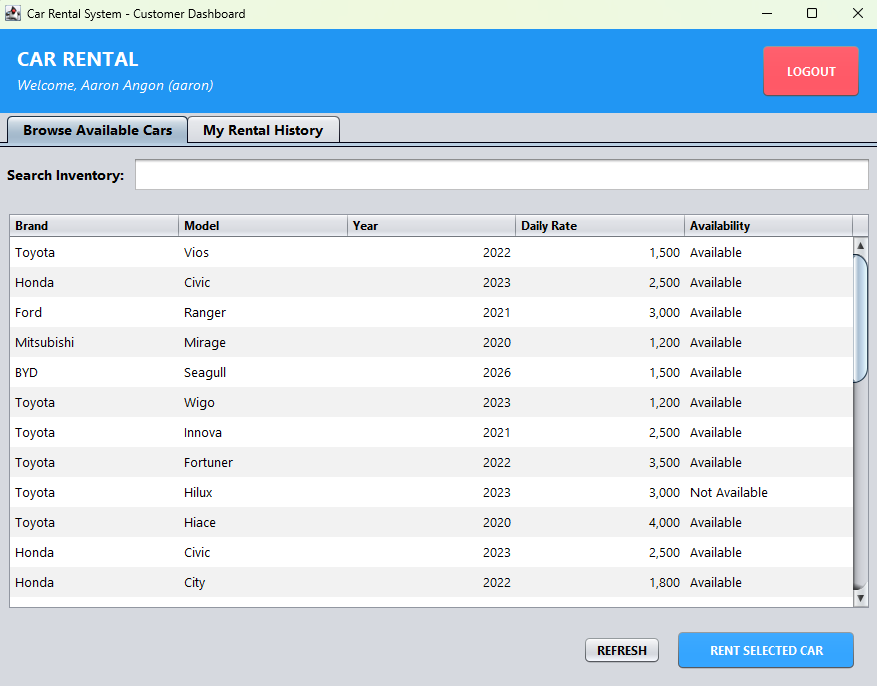
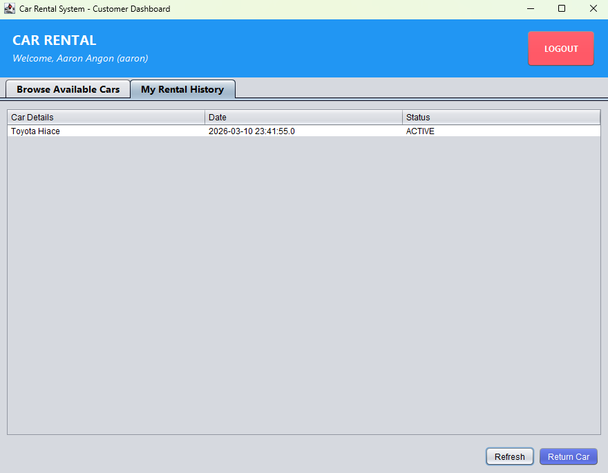
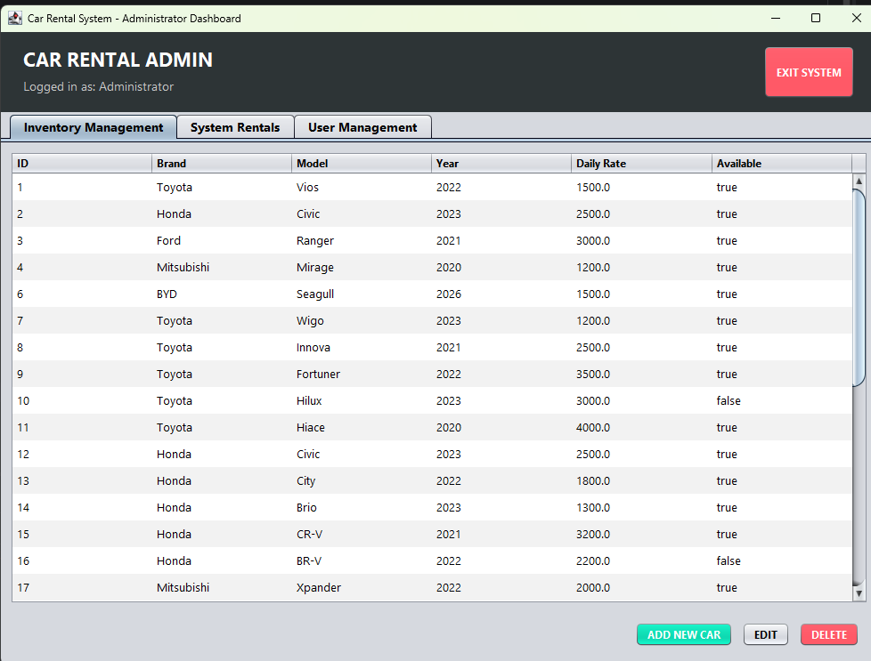
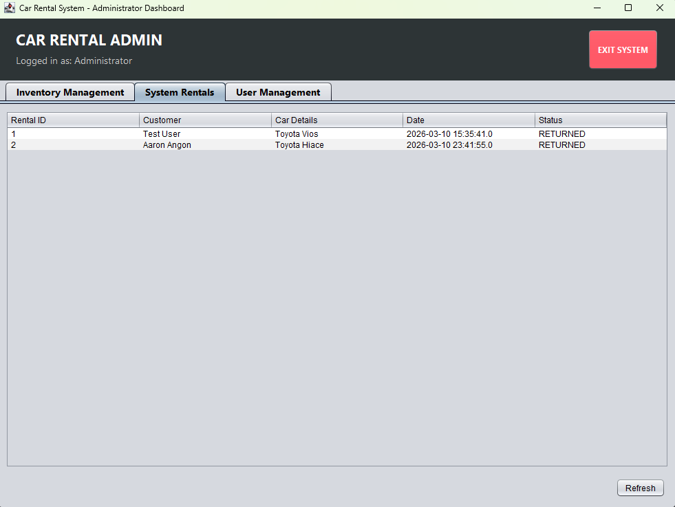
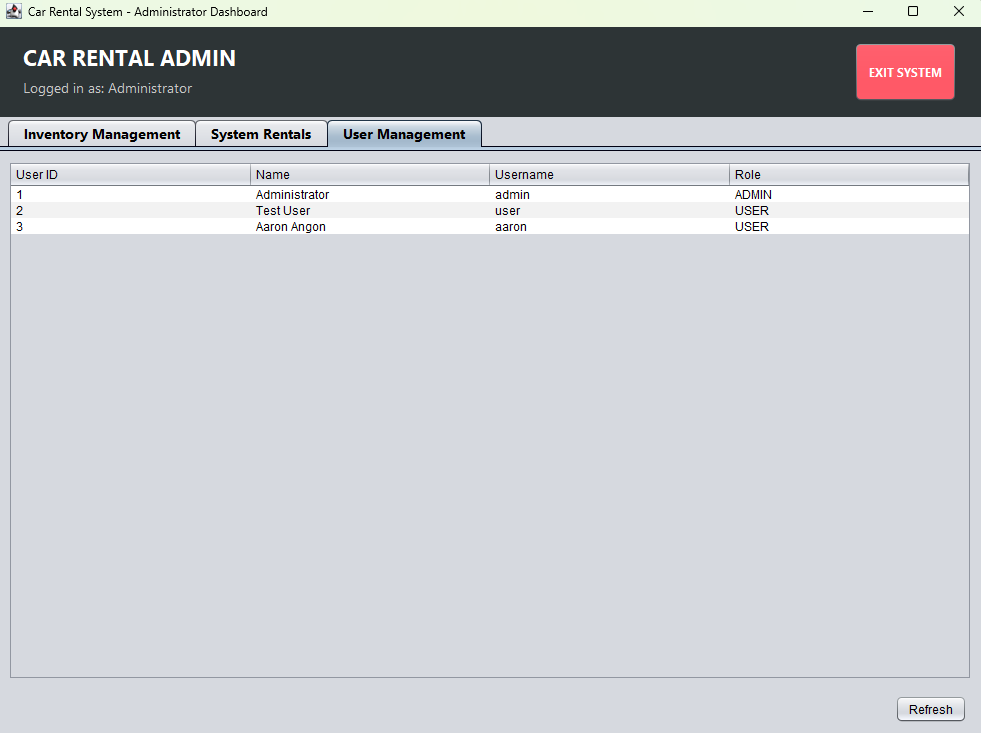

# CarRentalSystem

CarRentalSystem is a professional desktop application developed in Java using the Swing framework and MySQL. It provides a seamless experience for both customers to rent vehicles and administrators to manage the fleet and monitor transactions.

## Installation

### Prerequisites

*   **Java Development Kit (JDK)**: Version 8 or higher.
*   **MySQL Server**: Version 8.0 or higher.
*   **MySQL Connector/J**: The JDBC driver (included in the `lib` folder).

<!-- ### Database Setup

1.  Open your MySQL terminal or management tool (like MySQL Workbench).
2.  Execute the provided `database_setup.sql` script to create the database, tables, and initial data:

```sql
SOURCE database_setup.sql;
```

### Configuration

Update the database credentials in `src/database/DBConnection.java`:

```java
private static final String URL = "jdbc:mysql://localhost:3306/car_rental";
private static final String USER = "your_username";
private static final String PASS = "your_password";
```
-->

### Build and Run

Compile and run the `Main.java` file from your IDE or terminal.

## Features

### 👤 Customer Features
*   **User Registration & Login**: Secure account creation and authentication.
*   **Dynamic Car Inventory**: Browse available cars with real-time availability tracking.
*   **Advanced Search & Filtering**: Instantly search cars by brand, model, or year and sort by price.
*   **Rental Management**: Rent vehicles with a single click and track your active rentals.
*   **Seamless Returns**: Return rented vehicles directly from the dashboard.

### 🔑 Administrator Features
*   **Fleet Management**: Full CRUD operations (Add, Edit, Delete) for the car inventory.
*   **Transaction Monitoring**: View all rental records across the entire system.
*   **User Management**: Monitor and manage all registered accounts in the system.
*   **Inventory Control**: Toggle car availability manually if needed.

## Screenshots

|                                                             |                                                                     |
|:-----------------------------------------------------------:|:-------------------------------------------------------------------:|
|                      **Login Screen**                       |                         **Register Screen**                         |
|                            |                              |
|                     **User Dashboard**                      |                           **My Rentals**                            |
|                      |                |
|                     **Admin Dashboard**                     |                         **Manage Rentals**                          |
|               |           |

<p align="center">
  <b>Manage Users</b><br>
  
</p>

## Architecture

The system follows a clean **3-Layered Architecture** to ensure maintainability and scalability:

1.  **Presentation Layer (UI)**: Built with Java Swing using the **Nimbus Look and Feel**. It features a modern, color-coded interface for different user roles.
2.  **Business Logic Layer (Service)**: Managed by the `CarRentalAgency` class, which handles the core rules of renting and returning vehicles.
3.  **Data Access Layer (Repository)**: Uses **JDBC** with specialized repository classes (`UserRepository`, `CarRepository`, `RentalRepository`) for efficient database communication.

## Tech Stack

*   **Language**: Java
*   **GUI Framework**: Java Swing (Nimbus)
*   **Database**: MySQL
*   **Connectivity**: JDBC (Java Database Connectivity)

## Contributing

Pull requests are welcome. For major changes, please open an issue first to discuss what you would like to change.

Please make sure to update tests as appropriate.

## License

[MIT](https://choosealicense.com/licenses/mit/)
